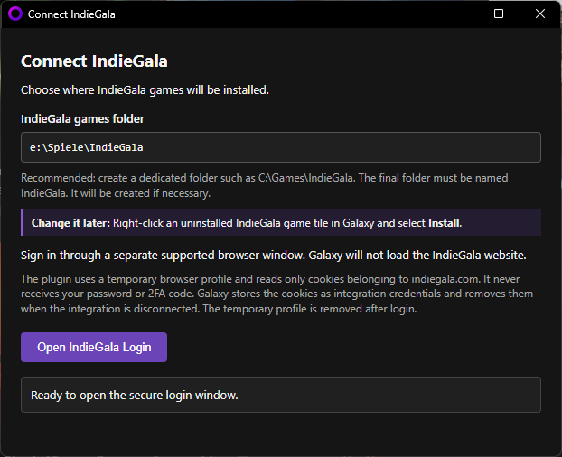
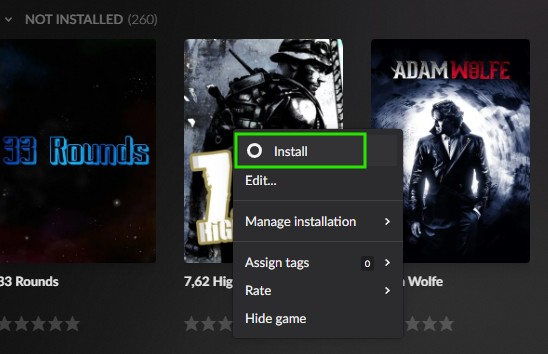
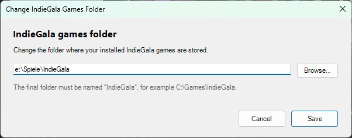
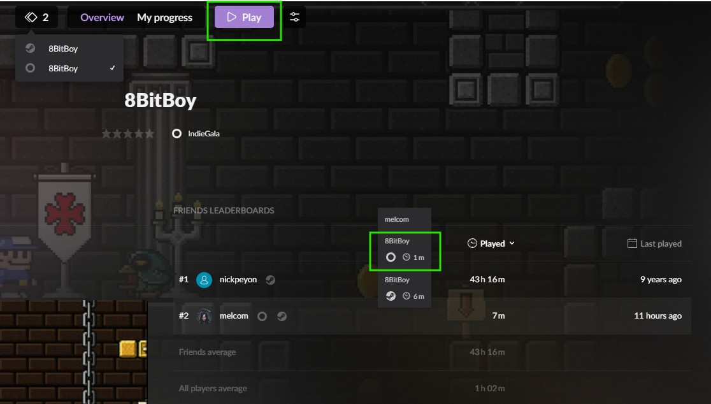

# IndieGala Integration Plugin for GOG Galaxy 2.1+ (64-bit)

This plugin imports your IndieGala Showcase library into GOG Galaxy 2.1+ 64-bit. Based on the original community integration, it has been updated for the current GOG Galaxy client and Python 3.13, with external-browser authentication, local game detection, launching, and Game-Time tracking.

---

## ✨ Features

* Imports games listed in your IndieGala Showcase collection into GOG Galaxy
* Uses a temporary external Firefox, Edge, Chrome, Opera, or Vivaldi profile for IndieGala sign-in
* Keeps the IndieGala website out of Galaxy's embedded browser
* Stores IndieGala browser cookies locally through Galaxy's integration credential storage
* Detects and launches games installed below a configured `IndieGala` folder
* Tracks local Game-Time while detected IndieGala games are running
* Lets you change the games folder through the Install action in an uninstalled IndieGala game's context menu
* Includes bundled Python 3.13 64-bit dependencies in `/modules/`

> [!NOTE]
> IndieGala determines which games appear in the Showcase collection. Purchases, bundles, or other titles that IndieGala does not list there cannot be imported by this plugin.

---

## 📦 Installation

### Automatic Installation with Plugin Updater (Recommended)

Once IndieGala is available in the [melcom GOG Galaxy Plugin Updater](https://github.com/melcom-creations/galaxy-integrations-64bit/tree/main/tools/melcom-galaxy_plugin_updater), you can use it to install or update the integration automatically.

1. Download and extract the Plugin Updater.
2. Double-click `update-plugins.bat`.
3. Select your preferred language.
4. Follow the displayed instructions.

### Manual Installation

1. Close GOG Galaxy completely, including the system tray application.
2. Download the latest release package from this repository.
3. Extract the ZIP archive directly into:

```text
%localappdata%\GOG.com\Galaxy\plugins\installed\
```

The resulting directory structure must look like this:

```text
%localappdata%\GOG.com\Galaxy\plugins\installed\
indiegala_a1a85742-f3e0-42ae-bde9-64ab7d0321cf\
|-- manifest.json
|-- plugin.py
|-- browser_auth.py
|-- game_time.py
|-- http_client.py
|-- install_location_dialog.ps1
|-- local.py
|-- local_settings.py
|-- modules\
`-- README.md
```

**Next step:** Continue with **First Connection and Initial Sync** below.

> [!IMPORTANT]
> Do not place backup copies of this plugin inside the `plugins\installed` directory. GOG Galaxy scans every folder inside this directory during startup, so duplicate plugin folders can cause GUID conflicts or load an outdated version.

---

## 🚀 First Connection and Initial Sync

1. Start GOG Galaxy.
2. Open **Settings -> Integrations -> IndieGala** and click **Connect**.
3. Enter the full path where your IndieGala games are or will be installed.
4. Use a dedicated folder named `IndieGala`, for example `C:\Games\IndieGala` or `E:\Games\IndieGala\`. The plugin creates the folder if necessary. Capitalization and a trailing backslash do not affect validation, but the final folder itself must be named `IndieGala`.



*The connection page configures the games folder before opening the secure external login.*

5. Click **Open IndieGala Login**.
6. Complete the sign-in in the temporary browser window. The plugin prefers the Windows default browser when it is Firefox, Edge, Chrome, Opera, or Vivaldi. Firefox is handled through WebDriver BiDi, while the Chromium-based browsers use their debugging protocol. If the default browser is unsupported, the plugin uses the first installed supported browser.
7. Enter your password and any two-factor authentication code only in that browser window.
8. Wait until the local Galaxy page confirms that the IndieGala login was verified.
9. Open the account menu in the top-right corner of GOG Galaxy and select **Sync integrations** once.
10. Wait until synchronization has finished. Metadata and cover art can take a few minutes to appear in Galaxy.

The plugin reads only cookies belonging to `indiegala.com` from the temporary browser profile. It never receives or stores your email address, password, or two-factor authentication code. After Galaxy stores the cookies as integration credentials, the browser is closed and the temporary profile is removed. A new browser login is required only when the stored IndieGala session expires, is revoked, is reset, or the integration is disconnected.

---

## 📁 Changing the Games Folder Later

Right-click any uninstalled IndieGala game tile in Galaxy and select **Install**. This action opens the games-folder editor. It does not download or install the selected game.



*Use the Install action in the game's context menu. The gray main Install button is not used for this feature.*

The editor displays the currently configured path. Enter a different path directly or select one with **Browse**, then click **Save**.



*The final folder must still be named `IndieGala`. A trailing backslash is optional.*

Saving the new path immediately refreshes local game detection. The plugin does not move existing game files, so move or reinstall them manually when changing to a different folder.

---

## 🎮 Manual Game Installation, Detection and Game-Time

IndieGala games must be downloaded and installed manually. Place each installed game in its own direct subfolder below the configured `IndieGala` folder:

```text
E:\Games\IndieGala\
|-- 8BitBoy\
|-- Another Game\
`-- More IndieGala Games\
```

The game subfolder must match either the title shown by IndieGala or its IndieGala slug. Matching ignores capitalization, spaces, and punctuation. If the plugin finds a safe game executable, Galaxy marks the game as installed within the next local scan, enables the purple **Play** button, detects its running state, and records local Game-Time.



*Once detection succeeds, the game can be launched through Galaxy and its local Game-Time appears in My progress.*

---

## 🔐 Data Storage and What Disconnect Removes

| Data | Local location | Result of clicking **Disconnect** |
|---|---|---|
| IndieGala browser cookies used for authentication | Galaxy's credential area inside `%ProgramData%\GOG.com\Galaxy\storage\plugins\indiegala_a1a85742-f3e0-42ae-bde9-64ab7d0321cf-<Galaxy-user-id>-storage.db` | Removed by Galaxy |
| Cached IndieGala library and locally tracked Game-Time | The normal cache area inside the same Galaxy plugin database | The local cache can remain |
| Configured IndieGala games folder | `%LOCALAPPDATA%\melcom-creations\GOG Galaxy Integrations\IndieGala\settings.json` | Remains |
| Temporary login browser profile | `%TEMP%\melcom-indiegala-auth-<browser>-<random>\` | Removed after normal login completion or plugin shutdown |

Clicking **Disconnect** removes the stored IndieGala authentication cookies. It does not delete the plugin database itself, the cached library and local Game-Time data inside it, or `settings.json`. If Galaxy, the plugin, or Windows is terminated before cleanup finishes, a clearly named temporary browser folder can remain under `%TEMP%`; it contains no password or two-factor authentication code and can be removed after all related browser and Galaxy processes are closed.

For complete local removal, first disconnect the integration and close Galaxy completely. Then remove only the IndieGala database named above, the IndieGala settings directory, and any remaining `%TEMP%\melcom-indiegala-auth-*` directories. Do not remove database or temporary files belonging to other applications.

---

## 🔄 Resetting the Plugin Database (Troubleshooting)

Reset the local plugin database if synchronization problems continue after restarting GOG Galaxy.

1. Close GOG Galaxy completely.
2. Open `C:\ProgramData\GOG.com\Galaxy\storage\plugins\`.
3. Find every file starting with `indiegala_` and ending in `-storage.db`.
4. Rename each matching file by appending `.old`, for example:

   `indiegala_xxxxxxxxx-storage.db` -> `indiegala_xxxxxxxxx-storage.db.old`

5. Start GOG Galaxy, reconnect the integration if necessary, select **Sync integrations** from the account menu once, and wait for synchronization to finish.

---

## 🛠️ What to Do If the Plugin Has Problems

If the database reset above does not resolve the problem, create a clean session with fresh diagnostic files before contacting me. The reset procedure preserves the previous database as a `.old` file; the steps below remove the active database so the issue can be reproduced from a clean state.

1. Close GOG Galaxy completely, including the system tray application.
2. Open the following directory and delete the existing log files:

   ```text
   %ProgramData%\GOG.com\Galaxy\logs
   ```

3. Open the plugin storage directory:

   ```text
   C:\ProgramData\GOG.com\Galaxy\storage\plugins
   ```

   Delete only the active IndieGala database file starting with `indiegala_` and ending in `-storage.db`. Do not delete database files belonging to other integrations. If you are unsure which file is correct, do not delete anything from this directory.
4. Start GOG Galaxy, reproduce the problem, and then close GOG Galaxy completely so the new log is fully written.
5. Return to the logs directory and locate the newly created IndieGala plugin log:

   ```text
   plugin-indiegala-a1a85742-f3e0-42ae-bde9-64ab7d0321cf.log
   ```

Send only this log file, not the entire logs folder. Include the exact steps taken, the expected and actual result, and whether the problem can be reproduced.

Without a fresh plugin log and a detailed description, I cannot reliably determine what is causing the problem. Once everything is ready, continue with [Support & Feedback](#-support--feedback) for contact options.

---

## 🙏 Credits

**Original Community Integration**  
Chris Burnham and contributors  
[burnhamup/galaxy-integration-indiegala](https://github.com/burnhamup/galaxy-integration-indiegala)

**64-bit Port, Python 3.13 Compatibility, External Browser Authentication and Maintenance**  
melcom

---

## 🤝 Support & Feedback

**GitHub Issues are intentionally disabled.** Health-related limitations prevent me from reliably managing separate issue trackers across all of my plugin repositories.

Before contacting me, follow **What to Do If the Plugin Has Problems** and prepare a fresh IndieGala plugin log with a detailed description.

* **GOG:** Send me a message or add me as a friend through my [GOG profile](https://www.gog.com/u/melcom).
* **Email:** `melcom @ gmx.net`
* **Discord:** `.melcom` - the leading dot is part of the username. You can send me a message or add me as a friend.

Logs can be attached directly or shared using an accessible cloud storage link, such as Dropbox, OneDrive, Google Drive, or a similar service. Response times may vary depending on my health and available development time. Thank you for your understanding.
